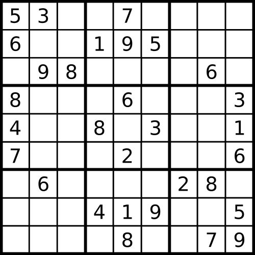
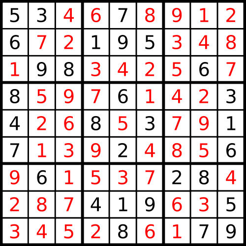
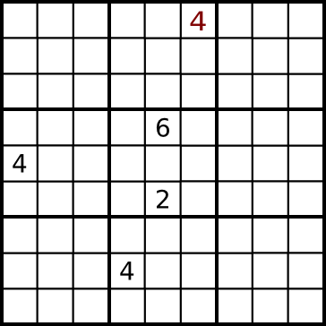

Sudoku with conda
=================

Solve Sudoku puzzles with conda.

**NOTE**: This is for fun only. If you want to actually solve Sudoku puzzles,
there are much better solvers out there. If you want to solve them using a SAT
solver, take a look at
[this blog post](https://www.continuum.io/blog/developer/sat-based-sudoku-solver-python)
by conda developer Ilan Schnell, which originally inspired this idea.

## How to use

To use this, run

     python3.5 sudoku.py

(note the script does require Python 3.5 or newer).

This will generate a repodata.json of packages, and tell you what command line
switch to use with conda, like `-c
file:///Users/aaronmeurer/Documents/Continuum/sudoku`.  Note because there are
730 "packages" we do not actually generate .tar.bz2 files for each one, just
the repodata.json metadata. Hence, you should install with
`--dry-run`. Otherwise, conda will attempt to download one of the packages and
fail. It's also a good idea to use `--override-channels` so that conda doesn't
bother with the default channels with real packages (although it will work
just fine without it).

Then take the puzzle. Say you have (from
[Wikipedia](https://en.wikipedia.org/wiki/Sudoku))

This corresponds to

    conda install --dry-run -c \
    file:///Users/aaronmeurer/Documents/Continuum/sudoku --override-channels \
    1x1-is=5 1x2-is=3 1x5-is=7 2x1-is=6 2x4-is=1 2x5-is=9 2x6-is=5 3x2-is=9 \
    3x3-is=8 3x8-is=6 4x1-is=8 4x5-is=6 4x9-is=3 5x1-is=4 5x4-is=8 5x6-is=3 \
    5x9-is=1 6x1-is=7 6x5-is=2 6x9-is=6 7x2-is=6 7x7-is=2 7x8-is=8 8x4-is=4 \
    8x5-is=1 8x6-is=9 8x9-is=5 9x5-is=8 9x8-is=7 9x9-is=9

(replace `-c file:///Users/aaronmeurer/Documents/Continuum/sudoku` with the
output from `sudoku.py`).  Each package corresponds to a cell (here 1x5 means
the first row and the fifth column; you could also interpret it to mean the
fifth row and the first column, due to the symmetry of Sudoku). The version of
the package corresponds to the number of the package. So `1x5-is=7` means that
`1x5-is` is version `7`, meaning cell 1 x 5 has a 7 in it.

This will take a few minutes, because conda is rather inefficient at this
problem. The result is

    The following NEW packages will be INSTALLED:

        1x1-is: 5-sudoku
        1x2-is: 3-sudoku
        1x3-is: 4-sudoku
        1x4-is: 6-sudoku
        1x5-is: 7-sudoku
        1x6-is: 8-sudoku
        1x7-is: 9-sudoku
        1x8-is: 1-sudoku
        1x9-is: 2-sudoku
        2x1-is: 6-sudoku
        2x2-is: 7-sudoku
        2x3-is: 2-sudoku
        2x4-is: 1-sudoku
        2x5-is: 9-sudoku
        2x6-is: 5-sudoku
        2x7-is: 3-sudoku
        2x8-is: 4-sudoku
        2x9-is: 8-sudoku
        3x1-is: 1-sudoku
        3x2-is: 9-sudoku
        3x3-is: 8-sudoku
        3x4-is: 3-sudoku
        3x5-is: 4-sudoku
        3x6-is: 2-sudoku
        3x7-is: 5-sudoku
        3x8-is: 6-sudoku
        3x9-is: 7-sudoku
        4x1-is: 8-sudoku
        4x2-is: 5-sudoku
        4x3-is: 9-sudoku
        4x4-is: 7-sudoku
        4x5-is: 6-sudoku
        4x6-is: 1-sudoku
        4x7-is: 4-sudoku
        4x8-is: 2-sudoku
        4x9-is: 3-sudoku
        5x1-is: 4-sudoku
        5x2-is: 2-sudoku
        5x3-is: 6-sudoku
        5x4-is: 8-sudoku
        5x5-is: 5-sudoku
        5x6-is: 3-sudoku
        5x7-is: 7-sudoku
        5x8-is: 9-sudoku
        5x9-is: 1-sudoku
        6x1-is: 7-sudoku
        6x2-is: 1-sudoku
        6x3-is: 3-sudoku
        6x4-is: 9-sudoku
        6x5-is: 2-sudoku
        6x6-is: 4-sudoku
        6x7-is: 8-sudoku
        6x8-is: 5-sudoku
        6x9-is: 6-sudoku
        7x1-is: 9-sudoku
        7x2-is: 6-sudoku
        7x3-is: 1-sudoku
        7x4-is: 5-sudoku
        7x5-is: 3-sudoku
        7x6-is: 7-sudoku
        7x7-is: 2-sudoku
        7x8-is: 8-sudoku
        7x9-is: 4-sudoku
        8x1-is: 2-sudoku
        8x2-is: 8-sudoku
        8x3-is: 7-sudoku
        8x4-is: 4-sudoku
        8x5-is: 1-sudoku
        8x6-is: 9-sudoku
        8x7-is: 6-sudoku
        8x8-is: 3-sudoku
        8x9-is: 5-sudoku
        9x1-is: 3-sudoku
        9x2-is: 4-sudoku
        9x3-is: 5-sudoku
        9x4-is: 2-sudoku
        9x5-is: 8-sudoku
        9x6-is: 6-sudoku
        9x7-is: 1-sudoku
        9x8-is: 7-sudoku
        9x9-is: 9-sudoku
        sudoku: 0-sudoku

You can see that this corresponds to the solution

## Unsatisfiability

If you input a puzzle that is unsatisfiable, conda will try to generate a
hint. For example, if you take the above puzzle and add `1x3-is=8`, this is
clearly incorrect (there is already an 8 in cell 3 x 3, which is both in the
same column and the same 3x3 square).

    conda install -c file:///Users/aaronmeurer/Documents/Continuum/sudoku --override-channels --dry-run 1x1-is=5 1x2-is=3 1x5-is=7 2x1-is=6 2x4-is=1 2x5-is=9 2x6-is=5 3x2-is=9 3x3-is=8 3x8-is=6 4x1-is=8 4x5-is=6 4x9-is=3 5x1-is=4 5x4-is=8 5x6-is=3 5x9-is=1 6x1-is=7 6x5-is=2 6x9-is=6 7x2-is=6 7x7-is=2 7x8-is=8 8x4-is=4 8x5-is=1 8x6-is=9 8x9-is=5 9x5-is=8 9x8-is=7 9x9-is=9 1x3-is=8
    Fetching package metadata: ..
    Solving package specifications: .
    Error: Unsatisfiable package specifications.
    Generating hint:
    [      COMPLETE      ]|############################################################################| 100%

    Hint: the following packages conflict with each other:
      - 3x3-is 8*
      - 1x3-is 8*

Conda is able to tell us that `1x3-is=8` fails because of `3x3-is=8`.

Now let's take a more complicated example. What if we try to set
`1x6-is=4`. We can see from the solution above that cell 1 x 6 is an 8, but
it's not immediately obvious from the initial puzzle why it can't be a 4.
Let's see what conda tells us

    conda --debug install -c file:///Users/aaronmeurer/Documents/Continuum/sudoku --override-channels --dry-run 1x1-is=5 1x2-is=3 1x5-is=7 2x1-is=6 2x4-is=1 2x5-is=9 2x6-is=5 3x2-is=9 3x3-is=8 3x8-is=6 4x1-is=8 4x5-is=6 4x9-is=3 5x1-is=4 5x4-is=8 5x6-is=3 5x9-is=1 6x1-is=7 6x5-is=2 6x9-is=6 7x2-is=6 7x7-is=2 7x8-is=8 8x4-is=4 8x5-is=1 8x6-is=9 8x9-is=5 9x5-is=8 9x8-is=7 9x9-is=9 1x6-is=4

    [      COMPLETE      ]|############################################################################| 100%

    Hint: the following packages conflict with each other:
      - 4x5-is 6*
      - 5x1-is 4*
      - 6x5-is 2*
      - 8x4-is 4*
      - 1x6-is 4*

When conda generates a "hint" it tries to find a minimal subset of the
specified packages that do not work together (minimal meaning that any smaller
subset would be satisfiable). You can run `conda --debug install -c ...` to
get a closer look at this bisection process. Let's look at a puzzle with just
these values.

We can see that just these four entries in the original puzzle are enough to
force cell 1 x 6 to not be 4. Basically, the two fours at 5 x 1 and 8 x 4 and
the two other entries in the middle square require that the 4 in the middle
square be in either cell 4 x 6 or 6 x 6 (we can see that in the solution to
the full puzzle indeed cell 6 x 6 is a 4). In either case, that is the 4 for
the 6th column, so cell 1 x 6 cannot be 4.

## Multiple solutions

A true Sudoku puzzle has a unique solution, but what if we remove some of the
numbers?

Conda will by default try to find all valid solutions that have maximal
versions and print a warning when there are more than one. Because the total
"versions" of packages in this case always equals 1*9 + 2*9 + ... 9*9, any
multiple set of solutions will be considered feasible by conda.

Suppose we remove the last two entries (9 x 8 and 9 x 9).

    conda install -c file:///Users/aaronmeurer/Documents/Continuum/sudoku --override-channels --dry-run 1x1-is=5 1x2-is=3 1x5-is=7 2x1-is=6 2x4-is=1 2x5-is=9 2x6-is=5 3x2-is=9 3x3-is=8 3x8-is=6 4x1-is=8 4x5-is=6 4x9-is=3 5x1-is=4 5x4-is=8 5x6-is=3 5x9-is=1 6x1-is=7 6x5-is=2 6x9-is=6 7x2-is=6 7x7-is=2 7x8-is=8 8x4-is=4 8x5-is=1 8x6-is=9 8x9-is=5 9x5-is=8
    Fetching package metadata: ..
    Solving package specifications: ....................................................................
    Warning: 2 possible package resolutions (only showing differing packages):
        ['1x7-is-9-sudoku.tar.bz2', '1x8-is-1-sudoku.tar.bz2', '5x7-is-7-sudoku.tar.bz2', '5x8-is-9-sudoku.tar.bz2', '9x7-is-1-sudoku.tar.bz2', '9x8-is-7-sudoku.tar.bz2'],
        ['1x7-is-1-sudoku.tar.bz2', '1x8-is-9-sudoku.tar.bz2', '5x7-is-9-sudoku.tar.bz2', '5x8-is-7-sudoku.tar.bz2', '9x7-is-7-sudoku.tar.bz2', '9x8-is-1-sudoku.tar.bz2'],

Conda has found two different solutions, and shows us the differences. The
first one is the original solution, but the other is a little different,
because we have some freedom on where to put some of the 7's and 9's because
they aren't set in the last two cells.

Be warned that conda will try to find *every* solution, so if you pass it a
puzzle that has many possible solutions conda may hang while it tries to
generate all of them. `conda install sudoku` will try to generate *every*
puzzle. This is not recommended!

## How does it work?

Let's look at the dependencies of one of the packages from the generated
`repodata.json`:

    "1x1-is-1-sudoku.tar.bz2": {
      "build": "sudoku",
      "build_number": 0,
      "date": "2015-10-02",
      "depends": [
        "sudoku",
        "2x1-is !=1",
        "3x1-is !=1",
        "4x1-is !=1",
        "5x1-is !=1",
        "6x1-is !=1",
        "7x1-is !=1",
        "8x1-is !=1",
        "9x1-is !=1",
        "1x2-is !=1",
        "1x3-is !=1",
        "1x4-is !=1",
        "1x5-is !=1",
        "1x6-is !=1",
        "1x7-is !=1",
        "1x8-is !=1",
        "1x9-is !=1",
        "2x2-is !=1",
        "2x3-is !=1",
        "3x2-is !=1",
        "3x3-is !=1"
      ],
      "name": "1x1-is",
      "size": 0,
      "version": "1"
    },

The package `1x1-is-1-sudoku.tar.bz2`, which corresponds to the top left cell
being a 1, requires that
every package corresponding to the cells in the first row, the first column,
or the top left 3x3 square are not version 1. In general, there are 81
packages with 9 versions each, each with dependencies requiring that the
packages for the respective cells in the same row, column, and 3x3 square are
not the same version. These restrictions force conda's SAT solver to find
package solutions that satisfy the Sudoku constraints.

Additionally, there is a metapackage called `sudoku`. Every cell package
depends on this metapackage. The dependencies of this metapackage are

    "sudoku-0-sudoku.tar.bz2": {
      "build": "sudoku",
      "build_number": 0,
      "date": "2015-10-02",
      "depends": [
        "1x1-is",
        "1x2-is",
        "1x3-is",
        "1x4-is",
        "1x5-is",
        "1x6-is",
        "1x7-is",
        "1x8-is",
        "1x9-is",
        "2x1-is",
        "2x2-is",
        "2x3-is",
        "2x4-is",
        "2x5-is",
        "2x6-is",
        "2x7-is",
        "2x8-is",
        "2x9-is",
        "3x1-is",
        "3x2-is",
        "3x3-is",
        "3x4-is",
        "3x5-is",
        "3x6-is",
        "3x7-is",
        "3x8-is",
        "3x9-is",
        "4x1-is",
        "4x2-is",
        "4x3-is",
        "4x4-is",
        "4x5-is",
        "4x6-is",
        "4x7-is",
        "4x8-is",
        "4x9-is",
        "5x1-is",
        "5x2-is",
        "5x3-is",
        "5x4-is",
        "5x5-is",
        "5x6-is",
        "5x7-is",
        "5x8-is",
        "5x9-is",
        "6x1-is",
        "6x2-is",
        "6x3-is",
        "6x4-is",
        "6x5-is",
        "6x6-is",
        "6x7-is",
        "6x8-is",
        "6x9-is",
        "7x1-is",
        "7x2-is",
        "7x3-is",
        "7x4-is",
        "7x5-is",
        "7x6-is",
        "7x7-is",
        "7x8-is",
        "7x9-is",
        "8x1-is",
        "8x2-is",
        "8x3-is",
        "8x4-is",
        "8x5-is",
        "8x6-is",
        "8x7-is",
        "8x8-is",
        "8x9-is",
        "9x1-is",
        "9x2-is",
        "9x3-is",
        "9x4-is",
        "9x5-is",
        "9x6-is",
        "9x7-is",
        "9x8-is",
        "9x9-is"
      ],
      "name": "sudoku",
      "size": 0,
      "version": "0"
    }

In other words, it depends on every single cell package.

Without this, conda may return "solutions" for some puzzles that aren't
completely filled out.
